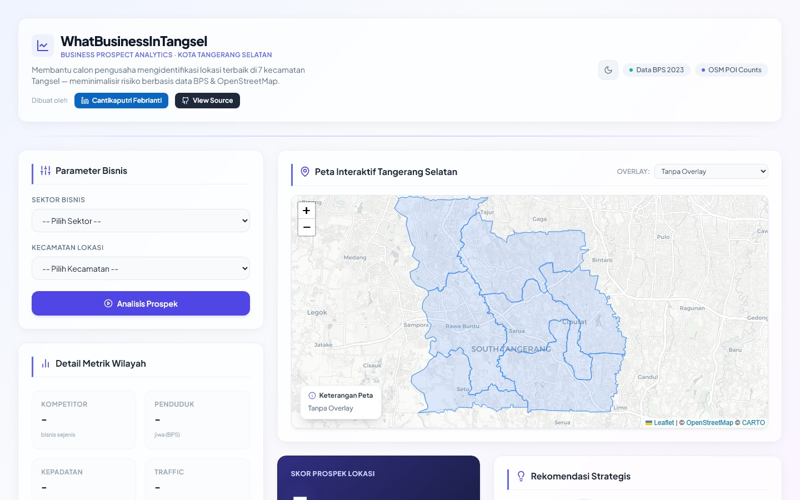

# Cantikaputri Febrianti — Professional Portfolio

Welcome to the source code of my professional portfolio website. I am a **Business Analyst** and **International Relations** graduate from Bina Nusantara University, with a focus on data analytics, geospatial intelligence, and strategic communication.

---

## 🗂️ Portfolio Sections

| Section | Content |
|---------|---------|
| [02 : Research](https://cantikapf.github.io/works.html) | Published academic papers & research |
| [03 : Work Experience](https://cantikapf.github.io/experience.html) | Professional roles across Bank Mandiri, DPR RI, LPEI |
| [04 : Certification](https://cantikapf.github.io/certification.html) | Professional certifications |
| [05 : Projects](https://cantikapf.github.io/projects.html) | Technical & data projects |

---

## 🚀 Featured Projects

### 001 · Tangsel Coffeeshop Business
> Interactive geospatial dashboard mapping 300+ coffee shops in Tangerang Selatan to support retail banking MSME acquisition strategy.

---

### 002 · My Digital Academy 2025 — Bank Mandiri
> Strategic project analyzing Bank Mandiri's Livin' apps competitive landscape, proposing UI/UX prototypes and go-to-market plans to boost digital banking adoption.

---

### 003 · Indonesia's Export Destination
> Tableau dashboard visualizing Indonesia's global trade routes, top export commodities, and destination countries across 2023 data.

---

### 004 · IR Study Companion
> Fine-tuned GPT model designed as a study companion for International Relations students — covering theories, historical contexts, and current global affairs.

---

### 005 · WhatBusinessInTangsel — Business Prospect Analytics

> Interactive BI dashboard helping entrepreneurs identify optimal business locations across 7 sub-districts in Tangerang Selatan using real BPS 2023 demographic data and OpenStreetMap POI data.

**Key Features:**
- 8-metric weighted scoring engine (demographics, competitor density, PDRB, rent cost, traffic, trend, POI)
- Interactive choropleth map with click-to-analyze per sub-district
- Side-by-side district comparison with radar charts
- Real data: BPS 2023 census + OpenStreetMap Overpass API
- Built with Next.js 14 + TypeScript

---

## 💻 Technical Architecture

The portfolio uses a **Dynamic Template Architecture** for maintainability:

- **Single `detail.html` template** — replaces 24+ static pages; content is injected dynamically from `assets/js/data.js` via URL params (`?type=&id=`)
- **Centralized `data.js` database** — all section content (HTML strings) stored in one `portfolioData` object
- **Responsive Bootstrap grid** — carousel-based navigation across all sections
- **Rich media embeds** — Tableau dashboards, Google Slides iframes, browser-chrome mockup frames

---

## 🔗 Related Repositories

- [WhatBusinessInTangsel BI Dashboard](https://github.com/cantikapf/tangsel-bisnis-v2)
- [Tangsel Coffeeshop Business](https://github.com/cantikapf/Tangsel-Coffeeshop-Business)
- [Parliamentary Diplomacy Sentiment Analysis](https://github.com/cantikapf/IPU144_sentiment_analysis)

---

## 📬 Let's Connect

- **LinkedIn:** [Cantikaputri Febrianti](https://www.linkedin.com/in/cantikaputri-febrianti/)
- **Email:** cantikapf.7@gmail.com
- **ResearchGate:** [Cantikaputri Febrianti](https://www.researchgate.net/profile/Cantikaputri-Febrianti)

---

*UI foundation adapted from the Univers template (Free-CSS).*
